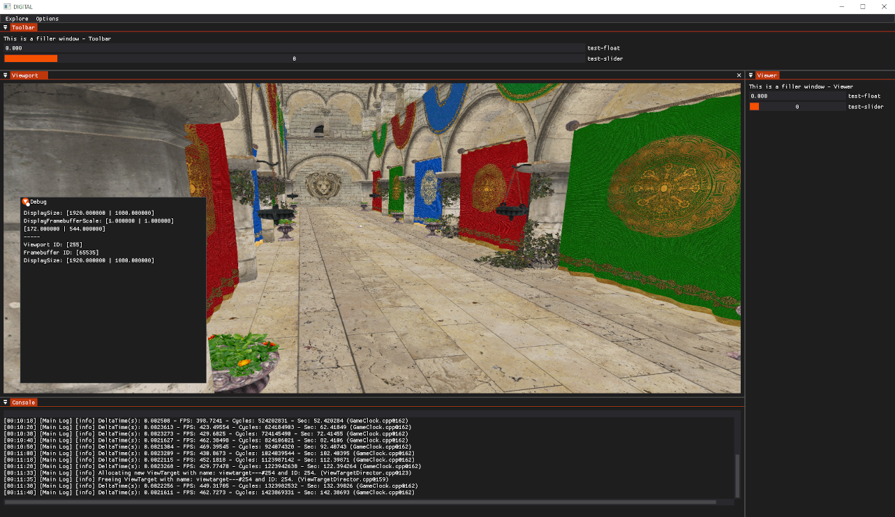

# DigitalFramework

### Instructions
- Windows / VisualStudio / MSVC
  - CMD
    - git clone https://github.com/TDCRanila/DigitalFramework
    - git submodule update --init --recursive
    - mkdir _'build'_
    - cd _'build'_
    - cmake..
    - open _'ProjectSolution.sln'_
  - Scripts
    - run 'ManuelInitSubmodules.bat'
    - run 'GenerateBuild-VS2022.bat'
    - run 'OpenBuild.bat'

### Engine Features

> At the moment, there are no fancy features, but the project has a good foundation to work on top of.
- Application Framework & Stage/Layers
- Input Management
- Window Rendering
- Model & Texture Loading using assimp
- CMake Project Management
- (Debug) Console & File Logging
- Basic Rendering & Shader support
- Debug Rendering (Line & Shapes)
- Class Reflection System
- 3D Physics using JoltPhysics
- ECS & Events using ENT
- ‘.map’ loading from level editor Trenchbroom
- ImGui (Window Docking & Multi-Viewport Support) hooked onto BGFX 
- Basic Gameplay Systems (UUIDs, Game Object handling, Camera)

### Credits
All credits to the respectful owners regarding the following libraries and or programs:
- [assimp](https://github.com/assimp/assimp)
- [bgfx](https://github.com/bkaradzic/bgfx); [bgfx.cmake](https://github.com/bkaradzic/bgfx.cmake)
- [boost](https://www.boost.org/doc/libs/) _(Partial subset of the library; boost//uuid, boost//container_hash)_
- [entt](https://github.com/skypjack/entt)
- [glfw](https://github.com/glfw/glfw)
- [glm](https://github.com/g-truc/glm)
- [imgui](https://github.com/ocornut/imgui/tree/docking) _(Docking branch)_
- [jolt-physics](https://github.com/jrouwe/JoltPhysics)
- [spdlog](https://github.com/gabime/spdlog)
- [stb](https://github.com/nothings/stb) _(stb_image)_
- [trenchbroom](https://trenchbroom.github.io/) & [libmap-cpp](https://github.com/QodotPlugin/libmap/)
​